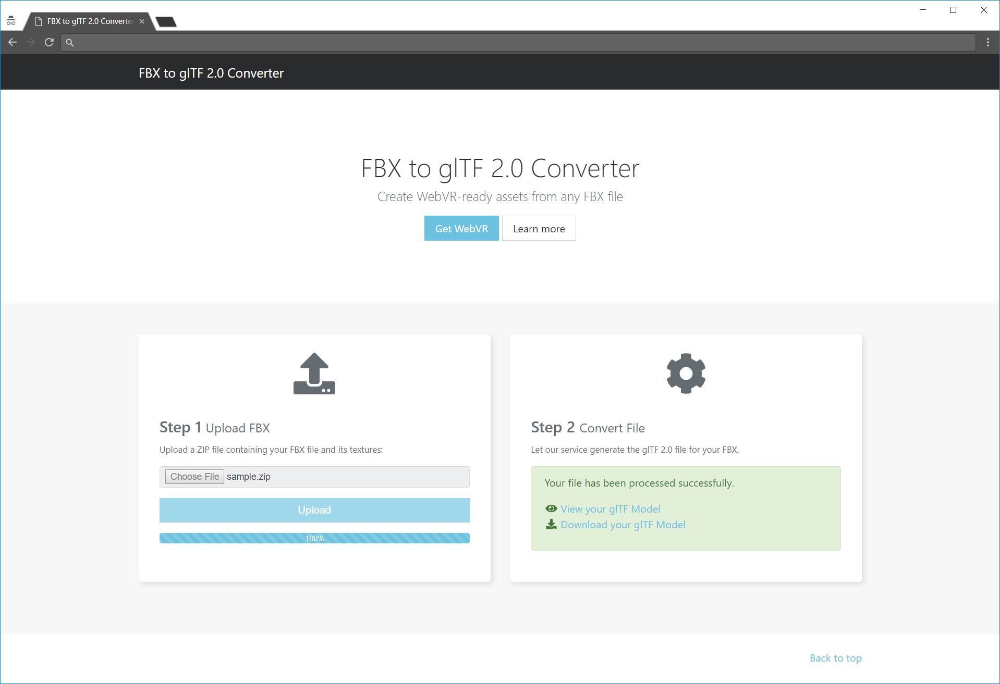
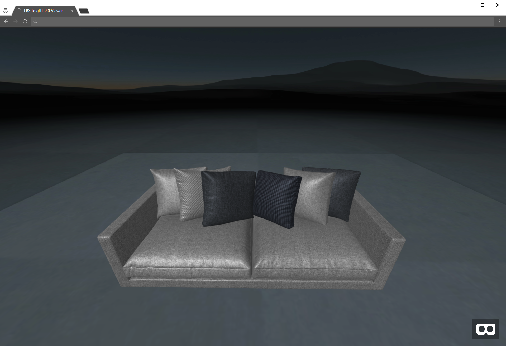

# FBX to glTF 2.0 Converter

> Convert FBX files to glTF 2.0 using [Facebook's converter](https://github.com/facebookincubator/FBX2glTF).

## Installation

 1. Clone this repository on your machine.
 2. Run `docker-compose build`
 3. Run `docker-compose up -d`

Then navigate to:
 * [http://localhost:3000](http://localhost:3000) to access the web interface to upload FBX files to the service.
   * Currently, only zipped FBX files with Embedded Media are supported.
 * [http://localhost:3000/queue](http://localhost:3000/queue) to access the job queue.

To run the test suites:
 1. Bring up the Docker services (see installation steps above).
 2. Run `npm test`

HTML test coverage can alternatively be generated using `npm run generate:coverage`. The browsable test coverage results will be placed in the _/coverage_ folder.

## Screenshots

_WebVR Viewer demo, using teleport controls:_  

_Upload page:_  

_Viewer page:_  

## Improvements

 * Use [AMQP](https://www.amqp.org/) or [RabbitMQ](https://www.rabbitmq.com/) instead of Redis for queue persistence, message ACK, etc.
 * Support more FBX options (i.e. not only Embedded Media).
 * Add mesh simplification options.
 * Support [Draco](https://github.com/google/draco) mesh compression.
 * Limit upload file sizes?
